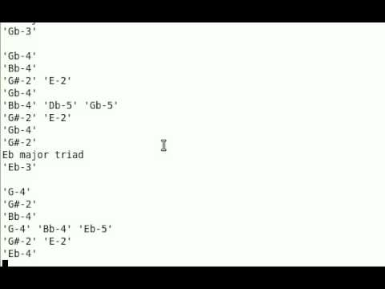

Applications
============

This is an overview of some of the applications that use mingus. If you know of or have written another program, open a pull request or get in contact and we'll add it to the list.

----

Example Application: Drum Machine
---------------------------------

*Description* A simple drum program with crude recording and playback support controlled by the keyboard.

*Platform* All

*Download* This program is included in mingus' `examples <https://github.com/bspaans/python-mingus/mingus_examples/>`_ directory.

.. image:: drum_machine.jpg

http://www.youtube.com/watch?v=FDdcz873tUQ

----

Example Application: Keyboard
-----------------------------

*Description* A keyboard controlled keyboard (yeah). Determines chords while you play them.

*Platform* All

*Download* This program is included in mingus' `examples <https://github.com/bspaans/python-mingus/mingus_examples/>`_ directory.

.. image:: keyboard.jpg

http://www.youtube.com/watch?v=dKTMie3nY7M

----

Improviser
----------

*Description* Automatic music generation software.

*Platform* All

*Download* Available at http://pypi.python.org/pypi/improviser/

http://www.youtube.com/watch?v=K3lpZV-ZaWc

----

:doc:`Back to Index </index>`
